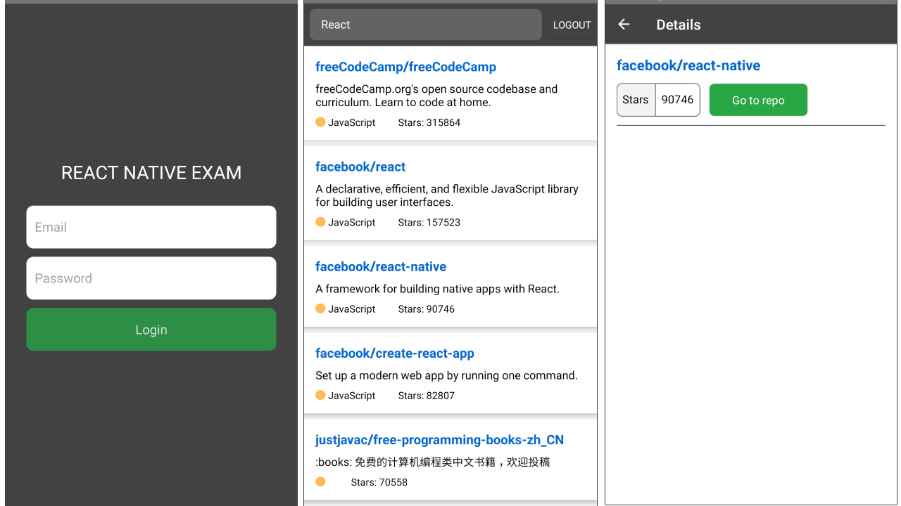

# Github App Exam

This application was built with bare react native and typescript for a coding exam.
  - Currently developed for Android only.
  - iOS - no tools available.


## Features
  - Basic Login/Logout
  - Search Github Repository (Paginated)
  - View Repository Details
  
### Additional Info
  - Typescript
  - Context API and React Hooks
  - Eslint + Prettier
  - Infinite Scrolling (Pagination)
  - Unit Testing (Soon)
  
## Local Setup
```bash
1. Clone the repository

2. Got to app directory
cd <project path>

3. Install packages
npm install

4. Run the application
npm run android     # Android
npm run ios         # IOS
```
## Folder Structure
```
project
└───android                                 # Native Android files
└───ios                                     # Native iOS files
└───src                                     # Main application folder
│   └─── assets                             # Application assets like images, etc
│   └─── config                             # Configuration files
│   └─── constants                          # Constants files like colors, size
│   └─── context                            # Application Contexts
│   └─── navigation                         # App Navigation files
│          └─── stacks                      # Contins root application stacks
│          └─── AppNavigation.tsx           # Main compiled navigation file
│          └─── AppRoutes.tsx               # Route names definitions
│          └─── RootNavigation.tsx          # Root navigation reference
│   └─── services                           # Application services (Auth, API, Common, etc)
│   └─── styles                             # Reusable styles
│   └─── utils                              # Utils such as formatters, etc.
│   └─── views                              # Display related components
│       └─── components                     # Reusable components
│       └─── containers                     # Application Modules Screens
│             └─── <Module>
│                   └─── styles             # Module related styles
│                   └─── ...<components>    # Module related components
│   └────App.tsx                            # Root application component
└───index.js                                # Application registry file
```
